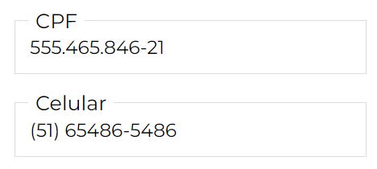
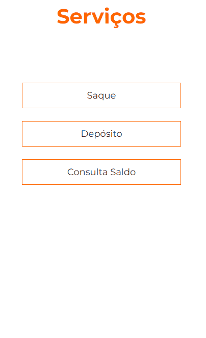

# DEVin[Philips] - M1S04: Exercícios da Semana 04

 Este repositório contém os exercícios da <strong>Semana 04</strong> do curso <strong>DEVinHouse</strong>  edição <strong>Philips</strong>.

## It's LIVE: [IR PARA O APP](https://dih-philips-week-exercises.herokuapp.com/M1S04/index.html)

## Módulo: 1

## Semana: 04

 

Este projeto consiste em um sistema de conta bancária para pessoa física com:

- Cadastro de clientes
- Depósitos
- Saques
- Consulta de saldo

 

 

## Máscaras para input
- CPF - formato 999.999.999-99
- Celular - formato (99) 99999-9999

 

## Validação de campos obrigatórios de formulário
- Via Javascript utilizando eventos *"onkeyup"* dos inputs
- Botão de envio do formulário de cadastro só é liberado quando campos obrigatórios estão preenchidos e senhas conferem
- Campo abaixo do formulário informa sobre os requisitos faltantes para liberação do botão de envio

  

## Seção de serviços/operações

- Expande para mostrar o formulário de preenchimento
- Campos do formulário são ocultos se não necessários para a operação selecionada

## Mensagens ao usuário
- ERRO: conta não encontrada ou senha incorreta 
- ERRO: saldo insuficiente para saque

  

 

- SUCESSO: conta criada com sucesso
- SUCESSO: depósito realizado com sucesso

 

## Logo DevinBANK

- Logo vetorizado criado utilizando Inkscape 1.2

