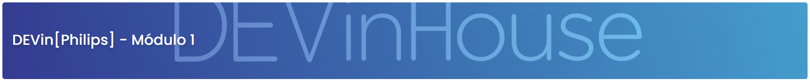
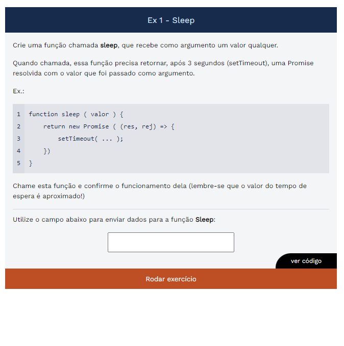
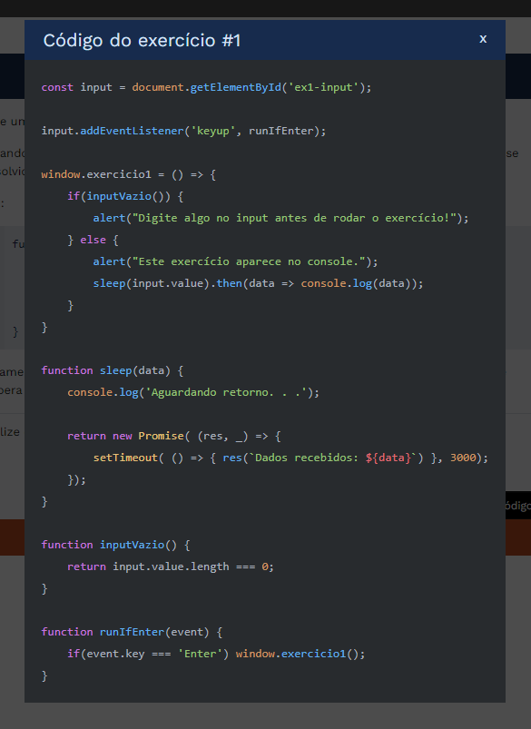

# DEVin[Philips] - M1S06: Exercícios da Semana 06

 Este repositório contém os exercícios da <strong>Semana 06</strong> do curso <strong>DEVinHouse</strong>  edição <strong>Philips</strong>.

## It's LIVE: [IR PARA O APP](https://dih-philips-week-exercises.herokuapp.com/M1S06/index.html)

## Módulo: 1

## Semana: 06

 

O **index.html** contém a relação de exercícios como uma lista de botões clicáveis.

Cada botão expande um container contendo o **enunciado** do exercício e um **botão** para rodar o **script** (arquivo .js) correspondente.

### Visualizar códigos

Através dos botões **ver código**, é possível visualizar pela própria página o conteúdo dos script (arquivos .js) referentes a cada exercício.

